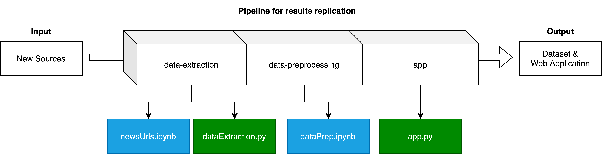

# Lupa Digital

missing web application link

## 🇵🇹 Português

**Lupa Digital** é um projeto desenvolvido no âmbito do concurso Prémios Arquivo.pt 2025, focado em metajornalismo inteligente. Utilizando ferramentas de inteligência artificial, o projeto analisa milhares de artigos jornalísticos desde o início da era digital para descobrir padrões, tendências e insights relevantes sobre qualquer tema. O objetivo é transformar grandes volumes de informação jornalística em conhecimento útil e acessível, contribuindo para o fortalecimento da literacia mediática e para uma compreensão mais crítica do ecossistema informativo.

## 🇬🇧 English

**Lupa Digital** is a project developed within the scope of the Arquivo.pt Awards 2025 competition, focused on intelligent metajournalism. Using artificial intelligence tools, the project analyzes thousands of news articles from the beginning of the digital era to uncover patterns, trends, and relevant insights on any topic. The goal is to transform large volumes of archived journalistic information into useful and accessible knowledge, contributing to the strengthening of media literacy and a more critical understanding of the information ecosystem.

----

**Summary description:** available [here](https://lupadigital25.github.io/assets/LupaDigital_hugoverissimo.pdf).

**Web application:** available HEREHEREHEREHERHERHEHREHRHEHRE.

**Resulting dataset:**  

---

The project follows a modular and reproducible pipeline:

  

1. **news-classifier**

(Optional) Train a model to identify and filter actual news articles from large collections of archived webpages — not necessary if you're only replicating the results, as the model is already trained.

2. **data-extraction**

Automatically extract metadata, full text, mentioned topics, and sentiment from each news article.

3. **data-preprocessing**

Pre-process the extracted data, including cleaning, normalization, and exploratory data analysis (EDA).

4. **app**

Create a web application (search engine) to visualize and interact with the processed data.

**Note:** Environment details and dependencies are defined in the `.github` repository under `LupaDigital25.yaml`.